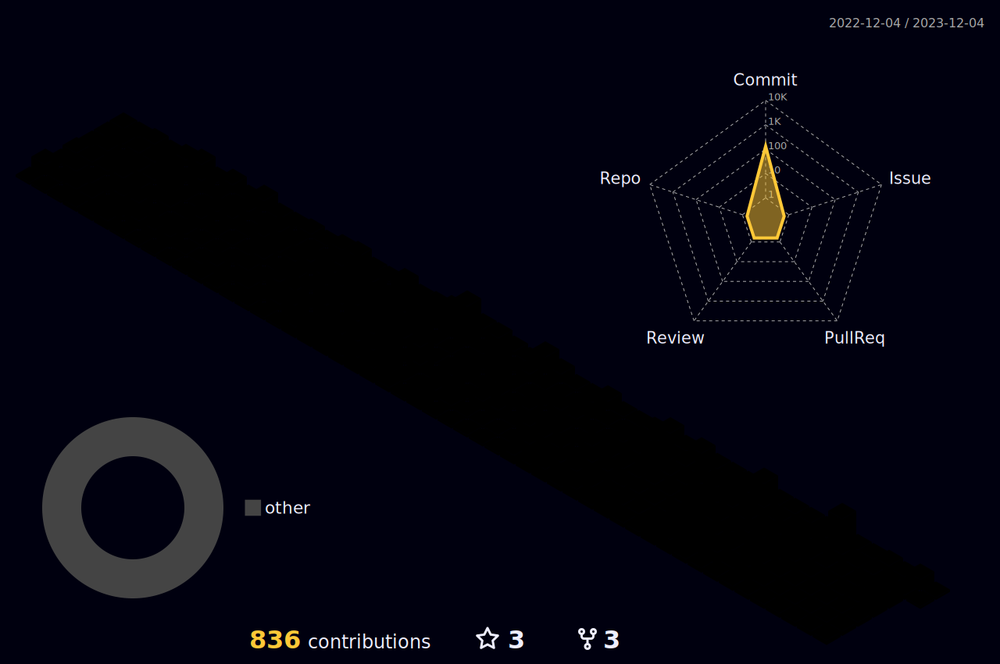

### Chris Park (durx4)

:thumbsup: Backend Engineer Dreaming of a Full Stack Engineer

:email: Email : namegpark@gmail.com  
:zap: Social : https://www.rocketpunch.com/@namegpark  

### Use Skills

* Programming Languages  
 
 
  
 
  

* Frameworks, Platforms and Libraries  
 
  
 
  
  

* Hosting/SaaS  
 

* Server  
 

* Database  
 
 

<!--
**z2est/z2est** is a ✨ _special_ ✨ repository because its `README.md` (this file) appears on your GitHub profile.

Here are some ideas to get you started:

- 🔭 I’m currently working on ...
- 🌱 I’m currently learning ...
- 👯 I’m looking to collaborate on ...
- 🤔 I’m looking for help with ...
- 💬 Ask me about ...
- 📫 How to reach me: ...
- 😄 Pronouns: ...
- ⚡ Fun fact: ...
-->
